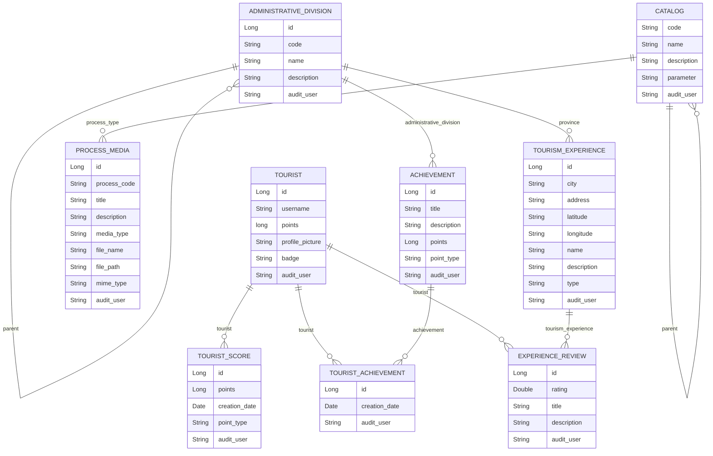

# er-diagram

```mermaid
erDiagram
    ADMINISTRATIVE_DIVISION {
        Long id
        String code
        String name
        String description
        String audit_user
    }

    ACHIEVEMENT {
        Long id
        String title
        String description
        Long points
        String point_type
        String audit_user
    }

    CATALOG {
        String code
        String name
        String description
        String parameter
        String audit_user
    }

    EXPERIENCE_REVIEW {
        Long id
        Double rating
        String title
        String description
        String audit_user
    }

    PROCESS_MEDIA {
        Long id
        String process_code
        String title
        String description
        String media_type
        String file_name
        String file_path
        String mime_type
        String audit_user
    }

    TOURISM_EXPERIENCE {
        Long id
        String city
        String address
        String latitude
        String longitude
        String name
        String description
        String type
        String audit_user
    }

    TOURIST {
        Long id
        String username
        long points
        String profile_picture
        String badge
        String audit_user
    }

    TOURIST_ACHIEVEMENT {
        Long id
        Date creation_date
        String audit_user
    }

    TOURIST_SCORE {
        Long id
        Long points
        Date creation_date
        String point_type
        String audit_user
    }

    ADMINISTRATIVE_DIVISION ||--o{ ADMINISTRATIVE_DIVISION : parent
    ADMINISTRATIVE_DIVISION ||--o{ ACHIEVEMENT : administrative_division
    ADMINISTRATIVE_DIVISION ||--o{ TOURISM_EXPERIENCE : province

    CATALOG ||--o{ CATALOG : parent
    CATALOG ||--o{ PROCESS_MEDIA : process_type

    TOURIST ||--o{ EXPERIENCE_REVIEW : tourist
    TOURISM_EXPERIENCE ||--o{ EXPERIENCE_REVIEW : tourism_experience

    TOURIST ||--o{ TOURIST_ACHIEVEMENT : tourist
    ACHIEVEMENT ||--o{ TOURIST_ACHIEVEMENT : achievement

    TOURIST ||--o{ TOURIST_SCORE : tourist
```